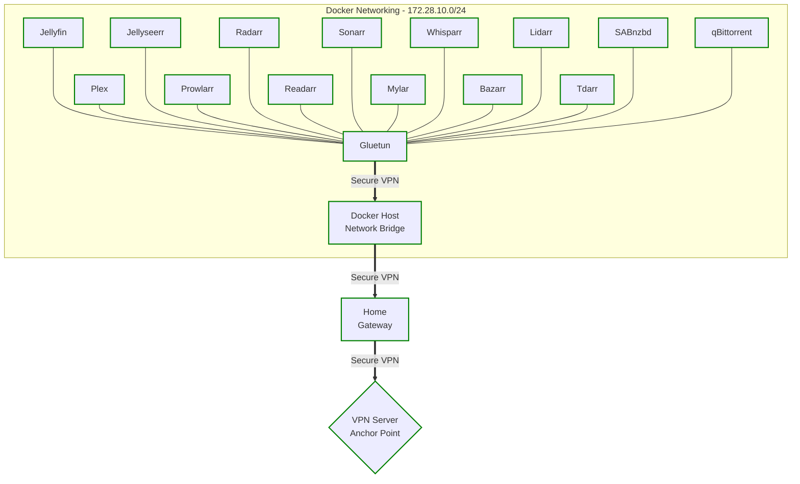
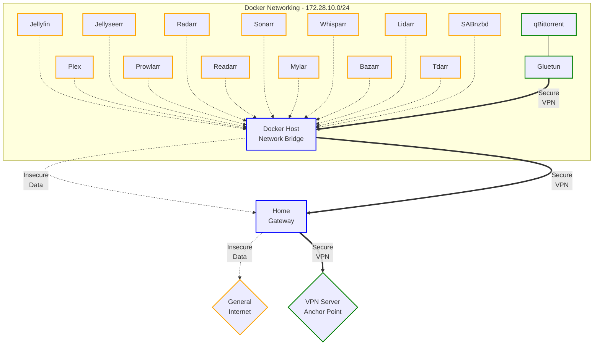
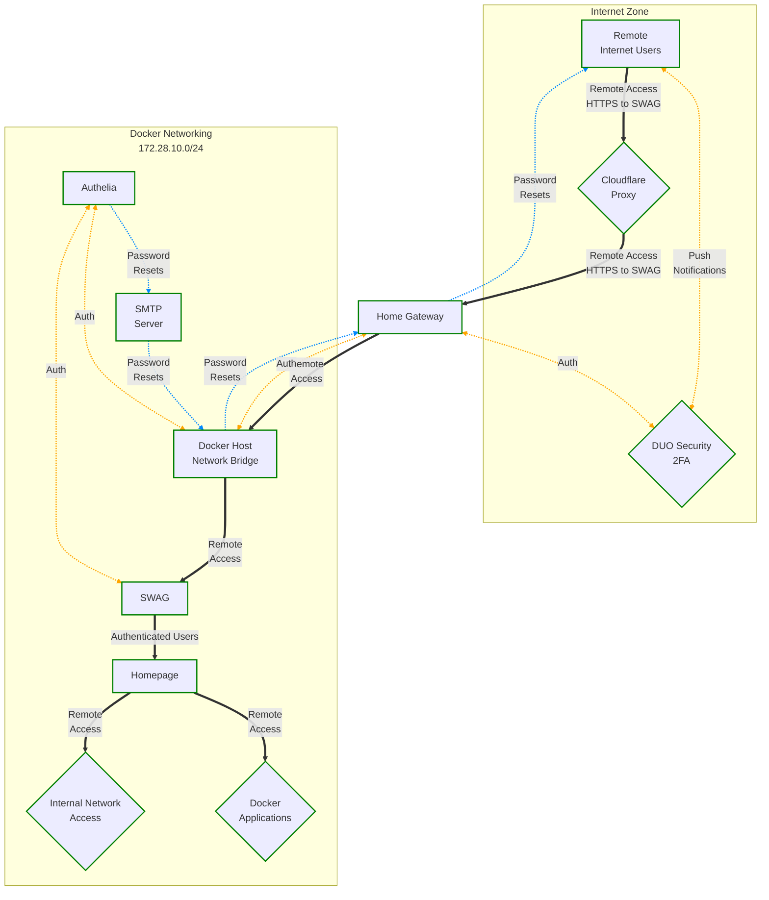
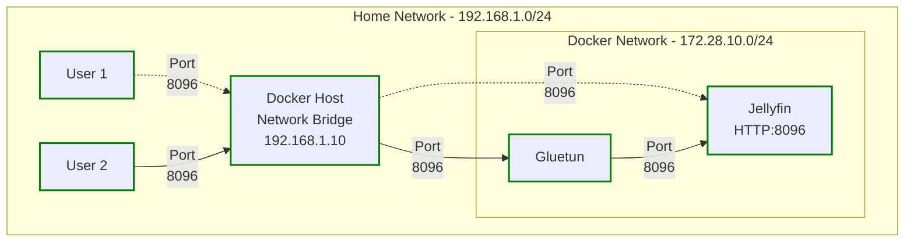

# MediaStack Project (Docker)  

Welcome to the MediaStack project! MediaStack is your ultimate solution for managing and streaming media collections with applications like Jellyfin and Plex. Using Docker, MediaStack containerises these media servers alongside *ARR applications (Radarr, Sonarr, Lidarr, etc.) for seamless media automation and management.  

You will be able to connect to the Docker MediaStack from the Internet using SWAG, which handles reverse proxy and web server tasks, ensuring secure and efficient traffic management. Authelia provides robust authentication to protect your remote access, and Heimdall serves as a convenient portal for accessing all your Docker applications in one place. Additionally, MediaStack leverages Cloudflare DNS and reverse proxy services, ensuring that remote access to your media is both secure and reliable. This setup provides two-factor authentication (2FA) using DUO Security Push Notifications (Cisco Systems), ensuring that users must verify their identities before gaining access, so you know you can remotely share your Docker applications, with the confidence that your collections are protected.  

MediaStack combines security, flexibility, and ease of use, making it the perfect choice for users who want comprehensive control over their media libraries. Whether you're streaming the latest movie, automating TV show downloads, or organising your music collection, MediaStack has you covered. Join the MediaStack community and elevate your media management experience.  

Full deployment and configuration guide is located at: [MediaStack.Guide](https://MediaStack.Guide)  

Discusson and assistance can be sort at: [MediaStack on Reddit](https://www.reddit.com/r/MediaStack/)  

> NOTE: Docker, and your MediaStack, can be installed on Windows, Linux, MacOS, and even NAS appliances such as Synology. All of the steps to configure Docker for your Operating System environment, are located on the main MediaStack.Guide website.  

> NOTE: MediaStack comes packed with both **Jellyfin** and **Plex** media players, so you have more options to choose from. However, you really only need one media player, so you can either disable or uninstall the media player you do not wish to keep.  
 
</br>

## TL;DR  

 - Head to "**mediastack**" repository at [https://github.com/geekau/mediastack](https://github.com/geekau/mediastack)  

 - Download the full "**mediastack**" repository to your computer by selecting "**Code**" --> "**Download Zip**"  

 - Extract the downloaded zip file on your computer, then go to the directory which suits your deployment method  

 - Update settings in **`docker-compose.env`** to suit your VPN account, local networking, and location of Docker Configuration Files / Media Storage  

 - Deploy all Docker containers - If deploying containers individually, the Gluetun VPN container must be deployed first  

 - Update and import the "**MediaStack.Guide Applications**" bookmarks file into your web browser to easily access each application's WebUI portal  

</br>

## What Is Docker And How Do I Use It

Docker is an open-source platform designed to automate the deployment, scaling, and management of applications using containerisation. Containers are lightweight, standalone, and executable software packages that include everything needed to run a piece of software, including the code, runtime, libraries, and system dependencies. Unlike traditional virtual machines, containers share the host computer's kernel, making them more efficient and faster to start up. This ensures that applications run consistently across different environments.

One of the key benefits of Docker is its cross-platform compatibility. Docker containers can run on any system that supports Docker, including various Linux distributions, Windows, and macOS. This MediaStack Project benefits the cross-platform architecture, as it can be deployed by more users, on more computers with different Operating Systems, which means MediaStack Project will work exactly the same, on many different computer systems.

Here is a great introduction to Docker video, for those who are new to containerisation.

<center>

[](https://youtu.be/pg19Z8LL06w-Y?t=0s "Docker Crash Course for Absolute Beginners")

</center>

</br>

## What Applications Are Provided In MediaStack  

The Docker applications located in the different directories are all extactly the same, however they differ on which Docker containers are secured via VPN for Internet traffic, and whether the MediaStack applications are deployed individually (**Multiple YAML files**), or collectively as a group (**Single YAML file**).  

List of Docker applications used in MediaStack:

</br>

<center>

| <center>Docker Application</center> | <center>Application Role</center> |  
|--------------------|------------------|  
| [Authelia](https://www.authelia.com) | Authelia provides robust authentication and access control for securing applications |  
| [Bazarr](https://www.bazarr.media) | Bazarr automates the downloading of subtitles for Movies and TV Shows |  
| [DDNS-Updater](https://github.com/qdm12/ddns-updater) | DDNS-Updater automatically updates dynamic DNS records when your home Internet changes IP address |  
| [FlareSolverr](https://github.com/FlareSolverr/FlareSolverr) | Flaresolverr bypasses Cloudflare protection, allowing automated access to websites for scripts and bots |  
| [Gluetun](https://github.com/qdm12/gluetun) | Gluetun routes network traffic through a VPN, ensuring privacy and security for Docker containers |  
| [Heimdall](https://heimdall.site) | Heimdall provides a dashboard to easily access and organise web applications and services |  
| [Homepage](https://gethomepage.dev/) | Homepage is an alternate to Heimdall, providing a similar dashboard to easily access and organise web applications and services |  
| [Jellyfin](https://jellyfin.org) | Jellyfin is a media server that organises, streams, and manages multimedia content for users |  
| [Jellyseerr](https://github.com/Fallenbagel/jellyseerr) | Jellyseerr is a request management tool for Jellyfin, enabling users to request and manage media content |  
| [Lidarr](https://lidarr.audio) | Lidarr is a Library Manager, automating the management and meta data for your music media files |  
| [Mylar3](https://github.com/mylar3/mylar3) | Mylar3 is a Library Manager, automating the management and meta data for your comic media files |  
| [Plex](https://www.plex.tv) | Plex is a media server that organises, streams, and manages multimedia content across devices |  
| [Portainer](https://www.portainer.io) | Portainer provides a graphical interface for managing Docker environments, simplifying container deployment and monitoring |  
| [Prowlarr](https://prowlarr.com) | Prowlarr manages and integrates indexers for various media download applications, automating search and download processes |  
| [qBittorrent](https://www.qbittorrent.org) | qBittorrent is a peer-to-peer file sharing application that facilitates downloading and uploading torrents |  
| [Radarr](https://radarr.video) | Radarr is a Library Manager, automating the management and meta data for your Movie media files |  
| [Readarr](https://readarr.com) | is a Library Manager, automating the management and meta data for your eBooks and Comic media files |  
| [SABnzbd](https://sabnzbd.org) | SABnzbd is a Usenet newsreader that automates the downloading of binary files from Usenet |  
| [Sonarr](https://sonarr.tv) | Sonarr is a Library Manager, automating the management and meta data for your TV Shows (series) media files |  
| [SWAG](https://github.com/linuxserver/docker-swag) | SWAG (Secure Web Application Gateway) provides reverse proxy and web server functionalities with built-in security features |  
| [Tdarr](https://tdarr.io) | Tdarr automates the transcoding and management of media files to optimise storage and playback compatibility |  
| [Unpackerr](https://github.com/davidnewhall/unpackerr) | Unpackerr extracts and moves downloaded media files to their appropriate directories for organisation and access |  
| [Whisparr](https://github.com/whisparr/whisparr) | Whisparr is a Library Manager, automating the management and meta data for your Adult media files |  

</center>
</br></br>

## Which Docker Configurations Should I Use  

The Docker applications located in the different directories are all extactly the same, however they differ on which Docker containers are secured via VPN for Internet traffic, and whether the MediaStack applications are deployed individually (**Multiple YAML files**), or collectively as a group (**Single YAML file**).  

If you are deploying the YAML files one at a time (multiple deployment), **you MUST deploy the Gluetun Docker container first**, as it sets up the "**mediastack**" network service for all other Docker containers to join.  

You can swap between the different YAML deployment types as / whenever you need, however you will need to ensure any configuration settings made in the **`docker-compose.env`** file, are copied into the new deployment folder.  

</br></br>  

## Full VPN Network Security  

This configuration set builds a fully encrypted VPN network architecture, and routes all network traffic from the Docker containers through the Gluetun container, where it is encrypted into a VPN, before it passes securely across the internet. This setup ensures that all data packets are encrypted, providing robust privacy and security. The primary benefit of this approach is the comprehensive protection of data, safeguarding against eavesdropping, and maintaining user privacy.  

However, this heightened security method comes with trade-offs. Encrypting and decrypting all traffic can lead to increased latency and reduced network speeds. This can particularly impact applications requiring high bandwidth or low latency, such as media streaming or real-time communication tools. Nonetheless, for users prioritising privacy and security over speed, this setup is ideal.  

</br>
<center>


</center>
<br><br>

> NOTE: Many of the Docker applications are passing traffic through the Gluetun VPN container. When the Gluetun container stops, or if the VPN network connection is interrupted, then all network traffic for the other Docker applications, will also stop until the secure VPN connection is re-established.

<br>

## Minimal VPN Network Security

This configuration set builds a minimal encrypted VPN network, soley for the BitTorrent network traffic coming from qBittorrent, which routes network traffic through the Gluetun Docker container, where it is encrypted into a VPN before routing out to the Internet. All other Docker containers connect to the Docker bridge network (not Gluetun), and pass their network traffic directly out to the Internet though your Internet Service Provider. This approach ensures that only the BitTorrent data is encrypted, while other containers operate with unencrypted traffic flows. The advantage here is that it maintains higher network performance for most applications, avoiding the latency and bandwidth reductions associated with full encryption.  

However, this comes at the cost of leaving some network traffic potentially exposed to interception or monitoring. This setup is suitable for users who require high performance for certain applications but still want to protect specific, sensitive activities.  

</br>
<center>



</center>
<br><br>

## Secure Remote Network Access  

All of the Docker configurations are set up to allow you to remotely access your Docker applications while you're away from home. The network diagram illustrates a secure remote access architecture utilising a combination of Docker applications, SWAG (Secure Web Application Gateway), Authelia, Cloudflare DNS, and 2FA Push Notifications from DUO Security (Cisco Systems). This setup ensures that only authenticated and trusted users that you grant permissions to, can access the internal Docker-based services from the Internet.

At the core of the network is the Docker infrastructure, operating on the subnet 172.28.10.0/24 (adjustable). Within this network, multiple applications are hosted in Docker containers. Once a remote user is successfully authenticated, they are granted access to Heimdall, which serves as a landing page portal provding users with easy access to the other Docker applications. To securely manage and route incoming connections, SWAG functions as both a reverse proxy and web server, and uses a valid SSL Digital Certificate to encrypt the remote HTTPS session. It intercepts requests from remote users and forwards them to the appropriate internal services.

Cloudflare plays a crucial role in enhancing security. It acts as the initial point of contact for remote Internet users, offering a robust reverse proxy service that filters and manages traffic before it reaches SWAG. 2FA Push Notification from DUO Security (Cisco Systems) provides an additional layer of security by enforcing an additionaly layer of authentication and access policies.

Authelia integrated with SWAG handles user authentication and authorisation, including 2FA Push Notifications with DUO Security (Cisco Systems), ensuring users must use more than just a password to protect their accounts and access to the MediaStand applications.

By combining these technologies, the setup ensures a secure, scalable, and manageable remote access solution. The network protects against unauthorized access while providing legitimate users with seamless access to the necessary applications, thus balancing security with user convenience.

</br>
<center>



</center>
<br><br>

## What If I Don't Want Remote Access  

All of the MediaStack Docker configurations deploy the Docker applications necessary to set up remote access into your home network, however, the remote access will only work if you configure the Docker environment with a valid domain name (DNS or DDNS), your Home Gateway is configured to port-forward network traffic into your home network, and you set up authentication with Authelia and DUO Security.  

So, while all Docker configurations deploy the Remote Access applications, the Remote Access will not work unless you follow the additional instructions to set up the authentication and access requirements. Therefore, if you don't want remote access, you can still safely install all of the Docker YAML configurations currently how they are now, without automatically granting Remote Access to your home network.  

</br>  

## What If I Don't Want To Use the Gluetun VPN  

Gluetun is the preferred choice for VPN, as it can route as many of the Docker containers through the VPN, or none at all. But more importantly, when Gluetun or the VPN tunnel stops, then all network traffic stops going out to the Internet, until the VPN connection is re-established.  

However, if you already have your own solution for VPN which you prefer to run, then it is recommended you use the **min-vpn_mulitple-yaml** configurations. This stack still has Gluetun VPN, but it only has the qBittorrent container using it, all other docker containers are just connecting directly to the "mediastack" docker bridge network.  

The **`docker-compose.env`** file is exactly the same in all configuration directories, so you can just move it over to the **min-vpn_mulitple-yaml** directory and run the commands again.  

Quickest way to set up without VPN, would be to:  

 - Deploy Gluetun container (as temporary step)  
 - Deploy qBittorent container  
 - Change qBittorrent to "mediastack" network  
 - Shutdown / remove the Gluetun container  

These steps should get you running without VPN, we just need to run Gluetun first as it has the network stack in it, but the Gluetun container can be removed once the network is up:  

```
sudo docker compose --file docker-compose-gluetun.yaml     --env-file docker-compose.env up -d
sudo docker compose --file docker-compose-qbittorrent.yaml --env-file docker-compose.env up -d
sudo docker network connect mediastack qbittorrent
sudo docker container stop gluetun
sudo docker container rm gluetun

... load remaining docker containers ...
```

Now all of your containers will be running unencrypted network traffic out of Docker, you will need to ensure you can route this traffic through your own VPN.  

You can check the IP Address on your qBittorrent container, to validate whether it is using your own ISP' IP address, or your VPN's IP address with the following commands - the commands are the same, not all containers have curl or wget available, so these should cover all options.  

```
sudo docker exec -it gluetun /bin/sh -c "curl ifconfig.me"
sudo docker exec -it gluetun /bin/sh -c "wget -qO- ifconfig.me"
```

Then lookup the location of your IP Address with [https://iplocation.net](https://iplocation.net), this will tell you if you're succefully connected to your remote VPN anchor point.  

If you already have a successful remote access connection into your home network, then when you run the docker compose commands, you will not need to run the following commands; you won't need these Docker containers:  

```
sudo docker compose --file docker-compose-swag.yaml     --env-file docker-compose.env up -d
sudo docker compose --file docker-compose-authelia.yaml --env-file docker-compose.env up -d
```

Hopefully this will get you to where you need your desired configuation. This info will eventually get into https://MediaStack.Guide and become part of the main documentation, so others can follow if they don't need VPN.  

</br>

## How To Access The Applications In Home Network  

Understanding how to access the Docker applications within your own home network can be a confusing concept for those new to Docker, more so when some of the Docker applications are hidden behind other Docker applications, such as Gluetun.  

Imagine the following deployment scenario:  

 - **User 1** has deployed their Docker applications using the "**Minimum VPN**" YAML files, so only the qBittorrent container is using the Gluetun VPN to encrypt network traffic to the Internet. Therefore, **User 1** accesses the **Jellyfin** application directly, with the URL of: **http://jellyfin:8096**.  

 - **User 2** has deployed their Docker applications using the "**Full VPN**" YAML files, which has all of the "Media Player" and "Downloading" Docker containers connecting to the Internet through the Gluetun VPN, encrypting all network traffic. Therefore, **User 2**  accesses the **Jellyfin** application by using the Gluetun container, which then uses port-redirection to forward the network traffic into Jellyfin. This URL will be: **http://gluetun:8096**.  

The YAML configuration files are already set up to do all the network firewalling, port forwarding, and VPN connections as standard, all that most people will need to do, it just update the **`docker-compose.env`** file and update all the IP Addresses for VPN login details for your own environment.  

</br>
<center>



</center>
</br></br>

The network settings for your home network, and the Docker network, can be adjusted in the **`docker-compose.env`** file. Likewise, if the Gluetun container is routing outbound VPN traffic for any of the Docker applications, it can also accept inbound network traffic and re-route the traffic to any of the Docker containers connected to the Gluetun VPN, based on the port redirect rules in the Gluetun YAML file.

The different network VPN security, and inbound redirection to the Gluetun attached Docker applications has already been configured in the YAML files, most users should just need to adjust the **`docker-compose.env`** file to suit your network IP addressing, then deploy the applications using the **`docker compose`** commands.

</br>

## How Are The Filesystems Mapped Between The Docker Application And The Host Computer ?

All of the filesystems are automatically mapped between your host computers hard drives, and the virtual drives within the Docker containers. The filesystem mapping is configured in all of the YAML configuration files, so the Docker applications use the same folder structure.

You will need to set up the following variables in the **`docker-compose.env`** environment configuration file, do Docker know this folders on the Docker host computer to use for the local data storage.

``` bash
FOLDER_FOR_MEDIA=/your-media-folder       # Change to where you want your media to be stored
FOLDER_FOR_DATA=/your-app-configs         # Change to where you want your container configurations to be stored
```

The **`FOLDER_FOR_MEDIA`** variable can be either Linux, Windows, MacOS, Synology, or NFS filesystems, and is the location for all of the **media storage, and transient download files** being used by the Bittorrent and Usenet applications. The filesystem mapping and directory structure between the Docker host computer, and the Docker applications, is shown in the folder structure below.  

The **`FOLDER_FOR_DATA`** variable can also be either Linux, Windows, MacOS, Synology, or NFS filesystems, and is the **configuration storage** for all of the Docker applications. Docker will store the running configuration of each of the Docker applications, into their own directory, inside the **`FOLDER_FOR_DATA`** directory.  

``` { .text .no-copy }
    $ tree $FOLDER_FOR_MEDIA

    ⠀⠀⠀⠀⠀Docker Host Computer:⠀⠀⠀⠀⠀⠀⠀⠀⠀Inside Docker Containers:
    ├── /FOLDER_FOR_MEDIA   ⠀       ├── /data
    ⠀⠀⠀⠀⠀├── media                  ⠀⠀⠀⠀├── media        <-- Media is stored / managed under this folder
    ⠀⠀⠀⠀⠀│⠀⠀⠀⠀├── anime                 │⠀⠀⠀⠀├── anime       <-- Sonarr Media Library Manager
    ⠀⠀⠀⠀⠀│⠀⠀⠀⠀├── audio                 │⠀⠀⠀⠀├── audio       <-- Lidarr Media Library Manager
    ⠀⠀⠀⠀⠀│⠀⠀⠀⠀├── books                 │⠀⠀⠀⠀├── books       <-- Readarr Media Library Manager
    ⠀⠀⠀⠀⠀│⠀⠀⠀⠀├── comics                │⠀⠀⠀⠀├── comics      <-- Mylar Media Library Manager
    ⠀⠀⠀⠀⠀│⠀⠀⠀⠀├── movies                │⠀⠀⠀⠀├── movies      <-- Radarr Media Library Manager
    ⠀⠀⠀⠀⠀│⠀⠀⠀⠀├── music                 │⠀⠀⠀⠀├── music       <-- Lidarr Media Library Manager
    ⠀⠀⠀⠀⠀│⠀⠀⠀⠀├── photos                │⠀⠀⠀⠀├── photos      <-- N/A - Add Personal Photos
    ⠀⠀⠀⠀⠀│⠀⠀⠀⠀├── tv                    │⠀⠀⠀⠀├── tv          <-- Sonarr Media Library Manager
    ⠀⠀⠀⠀⠀│⠀⠀⠀⠀└── xxx                   │⠀⠀⠀⠀└── xxx         <-- Whisparr Media Library Manager
    ⠀⠀⠀⠀⠀├── torrents               ⠀⠀⠀⠀├── torrents     <-- Folder for Torrent Downloads Data
    ⠀⠀⠀⠀⠀│⠀⠀⠀⠀├── anime                 │⠀⠀⠀⠀├── anime       <-- Anime Category (Sonarr)
    ⠀⠀⠀⠀⠀│⠀⠀⠀⠀├── audio                 │⠀⠀⠀⠀├── audio       <-- Audio Category (Lidarr)
    ⠀⠀⠀⠀⠀│⠀⠀⠀⠀├── books                 │⠀⠀⠀⠀├── books       <-- Book Category (Readarr)
    ⠀⠀⠀⠀⠀│⠀⠀⠀⠀├── comics                │⠀⠀⠀⠀├── comics      <-- Comic Category (Mylar)
    ⠀⠀⠀⠀⠀│⠀⠀⠀⠀├── complete              │⠀⠀⠀⠀├── complete    <-- Completed / General Downloads
    ⠀⠀⠀⠀⠀│⠀⠀⠀⠀├── console               │⠀⠀⠀⠀├── console     <-- Comic Category (Manual DL)
    ⠀⠀⠀⠀⠀│⠀⠀⠀⠀├── incomplete            │⠀⠀⠀⠀├── incomplete  <-- Incomplete / Working Downloads
    ⠀⠀⠀⠀⠀│⠀⠀⠀⠀├── movies                │⠀⠀⠀⠀├── movies      <-- Movie Category (Radarr)
    ⠀⠀⠀⠀⠀│⠀⠀⠀⠀├── music                 │⠀⠀⠀⠀├── music       <-- Music Category (Lidarr)
    ⠀⠀⠀⠀⠀│⠀⠀⠀⠀├── prowlarr              │⠀⠀⠀⠀├── prowlarr    <-- Uncategorised Downloads from Prowlarr
    ⠀⠀⠀⠀⠀│⠀⠀⠀⠀├── software              │⠀⠀⠀⠀├── software    <-- Software Category (Manual DL)
    ⠀⠀⠀⠀⠀│⠀⠀⠀⠀├── tv                    │⠀⠀⠀⠀├── tv          <-- TV Series (Sonarr)
    ⠀⠀⠀⠀⠀│⠀⠀⠀⠀└── xxx                   │⠀⠀⠀⠀└── xxx         <-- Adult / XXX Category (Whisparr)
    ⠀⠀⠀⠀⠀├── usenet                 ⠀⠀⠀⠀├── usenet       <-- Folder for Usenet Downloads Data
    ⠀⠀⠀⠀⠀│⠀⠀⠀⠀├── anime                 │⠀⠀⠀⠀├── anime       <-- Anime Category (Sonarr)
    ⠀⠀⠀⠀⠀│⠀⠀⠀⠀├── audio                 │⠀⠀⠀⠀├── audio       <-- Audio Category (Lidarr)
    ⠀⠀⠀⠀⠀│⠀⠀⠀⠀├── books                 │⠀⠀⠀⠀├── books       <-- Book Category (Readarr)
    ⠀⠀⠀⠀⠀│⠀⠀⠀⠀├── comics                │⠀⠀⠀⠀├── comics      <-- Comic Category (Mylar)
    ⠀⠀⠀⠀⠀│⠀⠀⠀⠀├── complete              │⠀⠀⠀⠀├── complete    <-- Completed / General Downloads
    ⠀⠀⠀⠀⠀│⠀⠀⠀⠀├── console               │⠀⠀⠀⠀├── console     <-- Comic Category (Manual DL)
    ⠀⠀⠀⠀⠀│⠀⠀⠀⠀├── incomplete            │⠀⠀⠀⠀├── incomplete  <-- Incomplete / Working Downloads
    ⠀⠀⠀⠀⠀│⠀⠀⠀⠀├── movies                │⠀⠀⠀⠀├── movies      <-- Movie Category (Radarr)
    ⠀⠀⠀⠀⠀│⠀⠀⠀⠀├── music                 │⠀⠀⠀⠀├── music       <-- Music Category (Lidarr)
    ⠀⠀⠀⠀⠀│⠀⠀⠀⠀├── prowlarr              │⠀⠀⠀⠀├── prowlarr    <-- Uncategorised Downloads from Prowlarr
    ⠀⠀⠀⠀⠀│⠀⠀⠀⠀├── software              │⠀⠀⠀⠀├── software    <-- Software Category (Manual DL)
    ⠀⠀⠀⠀⠀│⠀⠀⠀⠀├── tv                    │⠀⠀⠀⠀├── tv          <-- TV Series (Sonarr)
    ⠀⠀⠀⠀⠀│⠀⠀⠀⠀└── xxx                   │⠀⠀⠀⠀└── xxx         <-- Adult / XXX Category (Whisparr)
    ⠀⠀⠀⠀⠀├── watch                  ⠀⠀⠀⠀└── watch       <-- Add .nzb and .torrent files for manual download
    ⠀⠀⠀⠀⠀│
    ⠀⠀⠀⠀⠀│    ⠀⠀⠀⠀⠀    ⠀⠀⠀⠀⠀    ⠀⠀⠀ ⠀⠀      Below Folders Only Mapped To Filebot Container
    ⠀⠀⠀⠀⠀└── filebot               ├── /filebot
    ⠀⠀⠀⠀⠀ ⠀⠀⠀⠀├── input                 ├── input      <-- Add Files Here for Renaming by Filebot
    ⠀⠀⠀⠀⠀ ⠀⠀⠀⠀└── output                └── output     <-- Files Moved Here After Renaming by Filebot
```

</br>

Use the following script to automatically create all of the subdirectories for the **`FOLDER_FOR_MEDIA`** and **`FOLDER_FOR_DATA`** folders.

Update the following variables for your own needs: **`FOLDER_FOR_MEDIA`**, **`FOLDER_FOR_DATA`**, **`PUID`**, and **`PGID`**.

If using Linux, use the `sudo id username` to get the **`PUID`** and **`PGID`** values for your Docker user.

**Linux Based Command Line:**
``` bash
export FOLDER_FOR_MEDIA=/your-media-folder       # Change to where you want your media to be stored
export FOLDER_FOR_DATA=/your-app-configs         # Change to where you want your container configurations to be stored

export PUID=1000
export PGID=1000

sudo -E mkdir -p $FOLDER_FOR_DATA/{authelia/assets,bazarr,ddns-updater,gluetun,heimdall,homarr/{configs,data,icons},homepage,jellyfin,jellyseerr,lidarr,mylar,plex,portainer,prowlarr,qbittorrent,radarr,readarr,sabnzbd,sonarr,swag,tdarr/{server,configs,logs},tdarr_transcode_cache,unpackerr,whisparr}
sudo -E mkdir -p $FOLDER_FOR_MEDIA/media/{anime,audio,books,comics,movies,music,photos,tv,xxx}
sudo -E mkdir -p $FOLDER_FOR_MEDIA/usenet/{anime,audio,books,comics,complete,console,incomplete,movies,music,prowlarr,software,tv,xxx}
sudo -E mkdir -p $FOLDER_FOR_MEDIA/torrents/{anime,audio,books,comics,complete,console,incomplete,movies,music,prowlarr,software,tv,xxx}
sudo -E mkdir -p $FOLDER_FOR_MEDIA/watch
sudo -E mkdir -p $FOLDER_FOR_MEDIA/filebot/{input,output}
sudo -E chmod -R 775 $FOLDER_FOR_MEDIA $FOLDER_FOR_DATA
sudo -E chown -R $PUID:$PGID $FOLDER_FOR_MEDIA $FOLDER_FOR_DATA
```


**Windows Based Command Prompt:**
``` cmd
set FOLDER_FOR_MEDIA=D:\Your-Media-Folder        # Change to where you want your media to be stored
set FOLDER_FOR_DATA=D:\Your-App-Configs          # Change to where you want your container configurations to be stored

FOR /D %I IN (authelia\assets bazarr ddns-updater gluetun heimdall homarr\configs homarr\data homarr\icons homepage jellyfin jellyseerr lidarr mylar plex portainer prowlarr qbittorrent radarr readarr sabnzbd sonarr swag tdarr\server tdarr\configs tdarr\logs tdarr_transcode_cache unpackerr whisparr) DO mkdir %FOLDER_FOR_DATA%\%I
FOR /D %I IN (anime audio books comics movies music photos tv xxx) DO mkdir %FOLDER_FOR_MEDIA%\media\%I
FOR /D %I IN (anime audio books comics complete console incomplete movies music prowlarr software tv xxx) DO mkdir %FOLDER_FOR_MEDIA%\usenet\%I
FOR /D %I IN (anime audio books comics complete console incomplete movies music prowlarr software tv xxx) DO mkdir %FOLDER_FOR_MEDIA%\torrents\%I
mkdir %FOLDER_FOR_MEDIA%\watch
mkdir %FOLDER_FOR_MEDIA%\filebot\input %FOLDER_FOR_MEDIA%\filebot\output
```
</br>

> You can deploy the MediaStack Docker on other operating systems, such as Windows / Synology. Visit the [MediaStack.Guide](https://MediaStack.Guide) website to get the scripts to create the directory structure on Windows, MacOS, and Synology operating systems.  
>  
> PUID and PGID are not needed on Windows systems.  

</br>

## What Is The Difference Between The Single and Multiple YAML Configurations

All of the Docker configurations are the same, however, they can be deployed using a "Single" YAML file, or "Multiple" YAML files, depending on your needs and experience with Docker applications.

</br>

### Single YAML File Deployment:  

Advanced users often prefer a single YAML file as it encapsulates the entire network and application configurations in one place. This method simplifies management and ensures all services are deployed together, maintaining consistency and reducing the risk of configuration mismatches. However, this approach requires a deep understanding of Docker and YAML syntax, as a single error can disrupt the deployment of all services.  

Example:  

```
vi docker-compose.env
sudo docker compose --file docker-compose-mediastack.yaml --env-file docker-compose.env up -d
```

> NOTE: You must update the **`docker-compose.env`** file for your needs, prior to running **`docker compose`**.  

</br>

### Multiple YAML Files Deployment:  

New users benefit from using multiple YAML files, each dedicated to an individual Docker application. This modular approach simplifies troubleshooting and allows users to manage each service independently. If an issue arises, it’s easier to pinpoint and resolve. Additionally, it provides flexibility to update or redeploy specific applications without affecting the entire stack.  

**If you choose to deploy the Docker containers individually, you MUST deploy the Gluetun container first**. The Gluetun Docker container sets up the essential network configurations that establish the foundational network infrastructure for all other Docker containers. Without it, subsequent deployments will fail, as they rely on the network settings defined within the Gluetun YAML file. This prerequisite ensures that all containers can communicate correctly and securely within the Docker network.

> NOTE: You must update the **`docker-compose.env`** file for your needs, prior to running **`docker compose`**.  

</br>  

### Edit Environment Variables:  

Edit the .ENV file to update all of the variables to suit your home environment.  

``` bash  
vi docker-compose.env
```

</br>  

### Pull All Docker Images:  

You can use the following script to pull down all of the Docker images from all of the Docker Compose YAML files.  

This step is optional as images are pulled down during the deployment during the next step, however it will allow you to separate the steps if you want a little more control on stages.  

``` bash  
# Loop through all .yaml files in the current directory
for file in *.yaml; do
  echo "Pulling images from $file..."
  sudo docker compose --file "$file" --env-file docker-compose.env pull
done
```

> NOTE: Some older versions of Docker Compose may need to be deployed using command `docker-compose`, instead of the new `docker compose` command.  
>  
> Update the script above /below, if you need to use `docker-compose`.  

</br>  

### Deploy All Docker Containers:  

Use the following commands to deploy the Docker images.  

``` bash
sudo docker compose --file docker-compose-gluetun.yaml      --env-file docker-compose.env up -d
sudo docker compose --file docker-compose-qbittorrent.yaml  --env-file docker-compose.env up -d
sudo docker compose --file docker-compose-sabnzbd.yaml      --env-file docker-compose.env up -d

sudo docker compose --file docker-compose-prowlarr.yaml     --env-file docker-compose.env up -d
sudo docker compose --file docker-compose-lidarr.yaml       --env-file docker-compose.env up -d
sudo docker compose --file docker-compose-mylar.yaml        --env-file docker-compose.env up -d
sudo docker compose --file docker-compose-radarr.yaml       --env-file docker-compose.env up -d
sudo docker compose --file docker-compose-readarr.yaml      --env-file docker-compose.env up -d
sudo docker compose --file docker-compose-sonarr.yaml       --env-file docker-compose.env up -d
sudo docker compose --file docker-compose-whisparr.yaml     --env-file docker-compose.env up -d
sudo docker compose --file docker-compose-bazarr.yaml       --env-file docker-compose.env up -d

sudo docker compose --file docker-compose-jellyfin.yaml     --env-file docker-compose.env up -d
sudo docker compose --file docker-compose-jellyseerr.yaml   --env-file docker-compose.env up -d
sudo docker compose --file docker-compose-plex.yaml         --env-file docker-compose.env up -d

sudo docker compose --file docker-compose-homarr.yaml       --env-file docker-compose.env up -d
sudo docker compose --file docker-compose-homepage.yaml     --env-file docker-compose.env up -d
sudo docker compose --file docker-compose-heimdall.yaml     --env-file docker-compose.env up -d

sudo docker compose --file docker-compose-flaresolverr.yaml --env-file docker-compose.env up -d
sudo docker compose --file docker-compose-unpackerr.yaml    --env-file docker-compose.env up -d
sudo docker compose --file docker-compose-tdarr.yaml        --env-file docker-compose.env up -d

sudo docker compose --file docker-compose-portainer.yaml    --env-file docker-compose.env up -d
sudo docker compose --file docker-compose-filebot.yaml      --env-file docker-compose.env up -d

sudo docker compose --file docker-compose-swag.yaml         --env-file docker-compose.env up -d
sudo docker compose --file docker-compose-authelia.yaml     --env-file docker-compose.env up -d
sudo docker compose --file docker-compose-ddns-updater.yaml --env-file docker-compose.env up -d
```

</br>  

> If there are Docker applications you do not want to run in your MediaStack, then you just don't need to run the **`docker compose`** command for these applications.

</br>

## Check Status of VPN Connection

The MediaStack project focuses on **Security** and **Privacy** as some of the basic networking concepts, and uses the Gluetun Docker application to encrypt your network traffic as it passes across the Internet.

If you are having network connectivity issues, or would like to check the network status of your Docker applications, there are several commands / checks that you can perform to check on connection status.

 - Check running Docker processes:
```
sudo docker ps
```

 - Check IP Addresses of containers in the "mediastack" network:
```
sudo docker network inspect mediastack
```

 - Connect to Gluetun Docker container and check the IP Address:
```
sudo docker exec -it gluetun /bin/sh -c "curl ifconfig.me"
sudo docker exec -it gluetun /bin/sh -c "wget -qO- ifconfig.me"
```

 - Use the following command to connect to the Docker application and start a shell CLI:
```
sudo docker exec -it gluetun /bin/sh
```

 - Use the following web links to check your own IP Address, and the location of the VPN IP Address:

   - https://ifconfig.me  
   - https://iplocation.net  

<br>  

> **REMEMBER:**   If the Gluetun container is not running, or the VPN connection is down, then all Docker containers behind the Gluetun VPN container will stop passing network traffic.  

<br>

## How To Debug My Docker Deployment  

Occasstionally your Docker applications won't deploy properly on different systems, as we all have different configurations, such as networking, drive mappings, and even VPN credentials. When configurations are not correct, the Docker containers will fail to start, and we need to undertake some debugging to see the errors in the logs.  

Using the "**Individual Deployment**" method described above is the best way to debug, as we deploy only one Docker application at a time, allowing us to resolve the configuration issues in one application, before moving on to the next Docker application to deploy.  

Debug the Docker deployment by running the ```docker compose``` command on the CLI, without the ```-d``` switch, this will display all of the logs directly in the command prompt window.  

Example:  

```
sudo docker compose --file docker-compose-gluetun.yaml --env-file docker-compose.env up
```

Press **CTRL + C** once you have read the Docker application logs, and need to exit back to the CLI.  

You can also read the Docker logs for the application, by using the following command.  

```
docker logs gluetun
```

If you want to continuously view the logs in real-time, you can use the -f (follow) option:

```
docker logs -f gluetun
```

This command will display the logs and continue to update as new log entries are generated; press **CTRL + C** to quit stream the logs from Docker.  

Once you have identified and resolved any issues which prevented your Docker applications starting, then you can use the original ```-d``` command syntax to execute the Docker application in "Detacted Mode" (headless), so they continue to run in the background.  

```
sudo docker compose --file docker-compose-gluetun.yaml --env-file docker-compose.env up
```

</br>  


## WebUI Management For Docker - Portainer  

Managing Docker via the CLI can be complex and challenging, especially for users who are not familiar with command-line syntax and operations. The CLI requires precise commands and a good understanding of Docker’s functionalities, which can be time-consuming and prone to errors. 

MediaStack includes the "**Community Edition**" of Portainer, which offers a user-friendly alternative to CLI, by providing a graphical web application to manage Docker environments. With Portainer, users can easily deploy, configure, and monitor Docker containers through an intuitive interface. This reduces the complexity and learning curve associated with the CLI, making Docker management accessible and efficient for both beginners and experienced users. Portainer simplifies Docker operations, enhances productivity, and improves overall user experience.  

You can access your Portainer instance at: [http://localhost:9000](http://localhost:9000)  

</br>  

# Piracy Notice  

Using Docker to deploy the applications in the MediaStack is a great way to store, manage, and access your digital media that you own, or have legally acquired, and particularly when dealing with the digital media your children are exposed to. Docker allows easy deployment, updates, and maintenance, ensuring optimal performance without system interference.  

We strongly emphasise the ethical and legal use of technology, advocating for managing media that users have rights to, such as purchased copies. Our community does not condone or tolerate piracy or related discussions. Piracy violates intellectual property laws and undermines content creators. Our forums focus on supporting users in managing their media content legally and responsibly.  

By respecting legal guidelines and content creators' rights, we ensure a supportive, ethical community dedicated to lawful media management.  
